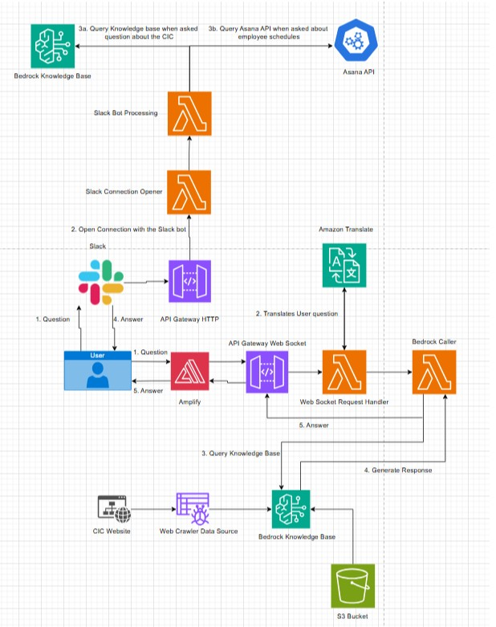

# cic-chatbot
Generative AI-powered chatbot for the Cloud Innovation Center's Website and Slack Channel 

## Architecture Diagram

### Architecture Diagram Explanation Amplify 
1. User asks the chatbot a question that is hosted by AWS Amplify.

2. The websocket request handler lambda function uses amazon translate to detect which language is being used and then 
translates the user question based on the language the user has selected. 

3. The User's translated question is handed over to the backend as a Web Socket API request which triggers the Web Socket Handler 
Lambda Function. The request is validated by the lambda function and is handed over to the Bedrock Caller Lambda function that sends 
a query to the bedrock knowledge base.

4. Amazon Bedrock uses an AI model to generate a response to the query.

5. The response that is generated by the AI model is then sent back to the bedrock caller Lambda Function, and it is sent as a 
response to the API, which then gets handed over to the front-end so the user can see the response.

### Architecture Diagram Explanation Slack
1. User in a slack channel uses the @ symbol to select the slack bot app and then asks a question to the bot.

2. The users request is sent over with an API gateway HTTP to the slack connection opener lambda function which establishes the 
connection.

3. The slack connection opener then invokes the slack bot processing lambda function. If the users question was a question about 
the CIC it will query the bedrock knowledge base for an answer, and if the question was about employee schedules it will reach out 
to the Asana API to get the schedule from an Asana project list that has tasks with the employee schdeules. 

## Documentation

- create-react-app: <https://github.com/facebook/create-react-app>
- material-ui getting started: <https://mui.com/material-ui/getting-started/templates/>
- ASU Brand Guide: <https://brandguide.asu.edu/brand-elements/design/color>
- ASU Unity Design System UI Kit: <https://zeroheight.com/9f0b32a56/p/5072ce-asu-unity-design-system-ui-kit>

